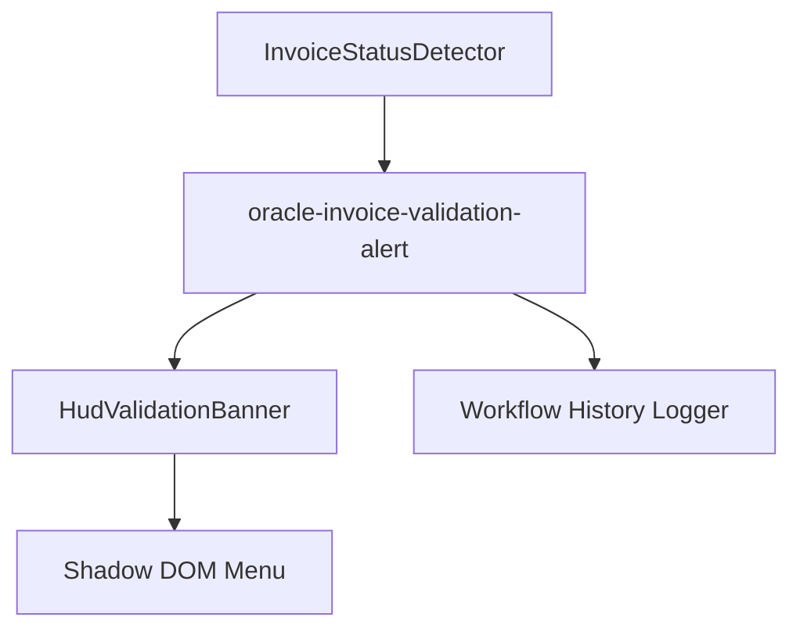

# Design Document

## Overview

Implement an Oracle auto-run workflow that detects invoice validation status, classifies the outcome, and renders a three-state animated banner inside the userscript HUD. The design introduces a reusable status detection helper, HUD alert renderer, and workflow definition that aligns with steering guardrails and approved requirements v0.2.

## Steering Document Alignment

### Technical Standards (tech.md)
- TypeScript-first implementation leveraging existing npm workspace.
- Reuse `@cv/core` workflow engine and MutationObserver-driven auto-run patterns.
- Persist banner state through GM_* storage only when required by diagnostics, preventing oracle DOM mutations beyond reads.

### Project Structure (structure.md)
- Place shared Oracle helpers under `packages/oracle-userscript/src/shared/`.
- Introduce one workflow file (`oracle-invoice-validation-alert.ts`) and register it via `packages/oracle-userscript/src/index.ts`.
- House any HUD UI additions under `packages/core/src/ui/` in their own modules to maintain single-responsibility per file.

## Code Reuse Analysis

### Existing Components to Leverage
- **`@cv/core/workflow`**: Provides declarative step execution, auto-run context tokens, and logging.
- **`@cv/core/ui`**: Baseline HUD rendering utilities; extend to host animated banner component.
- **Oracle shared selectors (pending)**: Build on existing Oracle selectors conventions inside `shared/` for stable targeting.

### Integration Points
- **Oracle userscript registry**: Register workflow in `packages/oracle-userscript/src/index.ts` alongside existing auto-run flows.
- **Workflow history logger**: Append structured diagnostics (status, snippet) to the existing history store for export.
- **Selector verification menu action**: Surface manual verification through the HUD actions registry.

## Architecture

Modular design splits detection, presentation, and workflow orchestration. The workflow orchestrates detection helper output and delegates presentation to the HUD banner module. Diagnostics funnel through the workflow logger for persistence.

### Modular Design Principles
- **Single File Responsibility**: Detection helper handles DOM scraping; HUD module handles visual animation; workflow file wires steps together.
- **Component Isolation**: HUD banner component exposes a narrow API (`showInvoiceValidationBanner`, `clearInvoiceValidationBanner`).
- **Service Layer Separation**: Workflow decisions (branching, retries) remain inside workflow definition; UI side-effects live in UI module.
- **Utility Modularity**: Animation tokens and color constants defined in a dedicated `hud-theme-validation.ts` utility.



## Components and Interfaces

### InvoiceStatusDetector (new)
- **Location:** `packages/oracle-userscript/src/shared/invoice/status-detector.ts`
- **Purpose:** Encapsulate DOM queries around the `ValidationStatus` cell, returning `{ status, snippet, diagnostics }`.
- **Interfaces:** `detectInvoiceValidationStatus(context: DetectorContext): Promise<DetectionResult>` with retries and optional manual verification mode.
- **Dependencies:** `@cv/core/selector`, `waitFor`, MutationObserver convenience utilities.
- **Reuses:** Steering-aligned selector patterns; uses requirements-provided DOM snippet for baseline matching.

### HudValidationBanner (new)
- **Location:** `packages/core/src/ui/hud-validation-banner.ts`
- **Purpose:** Render animated banner states inside HUD overlay.
- **Interfaces:**
  - `showValidationBanner(payload: { state: 'validated' | 'needs-revalidated' | 'unknown'; message: string; snippet: string; diagnostics: Diagnostics })`
  - `syncValidationBannerTheme(tokens: ValidationBannerTokens)`
  - `clearValidationBanner()`
- **Dependencies:** Existing HUD root container, CSS-in-JS utilities (or style injection helper) from `ui.ts`.
- **Reuses:** HUD theme tokens; extends menu shadow DOM without leaking styles to Oracle DOM.

### OracleInvoiceValidationAlertWorkflow (new)
- **Location:** `packages/oracle-userscript/src/workflows/oracle-invoice-validation-alert.ts`
- **Purpose:** Auto-run workflow that orchestrates detection, logs results, renders banner, and exposes manual verification action.
- **Interfaces:** `WorkflowDefinition` export with steps: wait for invoice header, run detector via `execute` action, branch on result, call HUD banner helper, and log history.
- **Dependencies:** `InvoiceStatusDetector`, `HudValidationBanner`, `@cv/core` workflow DSL.
- **Reuses:** Auto-run context token utilities from `packages/core/src/autorun.ts`.

### ValidationBannerTokens (new)
- **Location:** `packages/core/src/ui/hud-theme-validation.ts`
- **Purpose:** Centralize color palette, timing, easing, and spacing constants for the banner states.
- **Interfaces:** `getValidationBannerTokens()` returning tokens; exported types for tests.
- **Dependencies:** None external; relies on steering color guidance.
- **Reuses:** Aligns with existing theme tokens defined in HUD modules.

## Data Models

### DetectionResult
```
type DetectionResult = {
  status: 'validated' | 'needs-revalidated' | 'unknown';
  snippet: string; // sanitized innerText/outerHTML excerpt
  elementPath: string; // header + aria lineage summary
  attempts: number; // retry count used
  verified: boolean; // true when invoked via manual verification action
};
```

### ValidationBannerTokens
```
type ValidationBannerTokens = {
  validated: { baseColor: string; pulseAccent: string; durationMs: number; easing: string; shadow: string };
  needsRevalidated: { startColor: string; endColor: string; keyframes: number[]; iconId: string };
  unknown: { gradient: [string, string]; flashDurationMs: number; fallbackColor: string };
  layout: { maxViewportHeightPct: number; horizontalPaddingPx: number; verticalPaddingPx: number; fontMinPx: number; fontMaxPx: number };
};
```

## Error Handling

### Error Scenarios
1. **Status Element Missing:**
   - **Handling:** Detector exhausts retries, returns `unknown` with diagnostic summary; workflow renders unknown-state banner and logs failure event.
   - **User Impact:** HUD displays unknown banner prompting manual review and verifying selectors.

2. **HUD Banner Render Failure:**
   - **Handling:** Catch exceptions from HUD render, log with `logger.error`, and emit non-blocking toast via existing logging panel while keeping workflow state recorded.
   - **User Impact:** Analyst sees console/log entry; workflow marks status as `unknown` but continues operations without auto-repeat.

3. **Manual Verification Differs from Baseline:**
   - **Handling:** workflow raises confirmation dialog instructing analysts to pause auto-run and notify maintainers; log includes diff between expected snippet and captured text.
   - **User Impact:** Operators receive actionable message to reconcile selectors before re-enabling repeat.

## Testing Strategy

### Unit Testing
- Add Vitest coverage for `InvoiceStatusDetector` using jsdom fixtures replicating the captured DOM snippet and edge cases (missing header, alternate casing).
- Test `ValidationBannerTokens` to ensure easing, keyframes, and layout numbers align with requirements.

### Integration Testing
- Create jsdom-based workflow test that stubs HUD banner and ensures workflow branches invoke correct helpers and log payloads.
- Verify manual verification action toggles `verified` flag and surfaces diff output when snippet changes.

### End-to-End Testing
- Manual validation in Oracle sandbox following script: load invoice header, observe auto-run banner for each status using forced DOM mocks via dev console.
- Conduct selector/test walkthrough with requestor before marking tasks ready, confirming the recorded DOM snippet still matches production.
